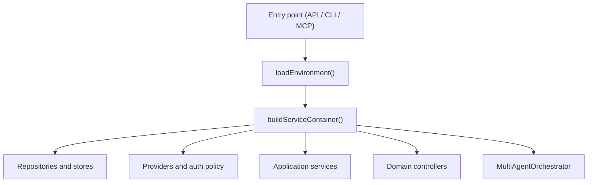
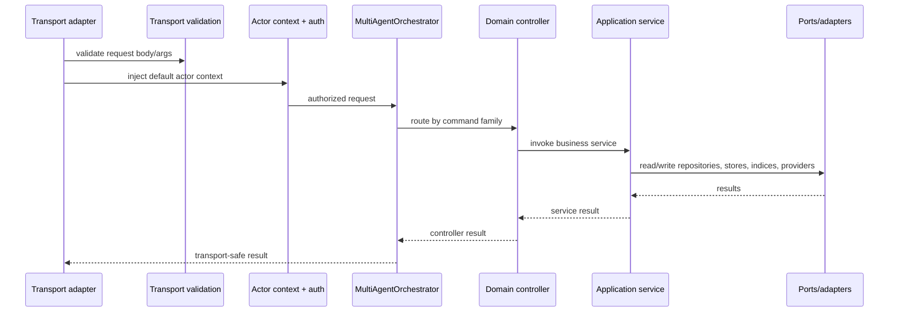
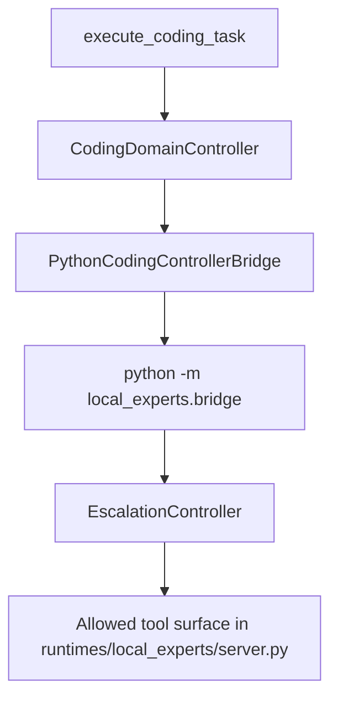

# Runtime flow

This file describes how requests move through the current implementation.

## Startup flow

Key files:

- `apps/brain-api/src/main.ts`
- `apps/brain-cli/src/main.ts`
- `apps/brain-mcp/src/main.ts`
- `packages/infrastructure/src/config/env.ts`
- `packages/infrastructure/src/bootstrap/build-service-container.ts`

## Request flow for routed commands

Transport examples:

- HTTP uses `validateTransportRequest()` in `apps/brain-api/src/server.ts`
- CLI uses the same validation in `apps/brain-cli/src/main.ts`
- MCP uses the same validation in `apps/brain-mcp/src/main.ts`

## Retrieval flow

The default retrieval path lives in `packages/application/src/services/retrieve-context-service.ts`.

High-level sequence:

1. classify the query intent
2. run lexical retrieval
3. run vector retrieval
4. fuse rankings
5. optionally rerank
6. assess answerability
7. assemble a bounded packet
8. emit freshness and degradation warnings
9. optionally enrich uncertainty with the paid escalation provider
10. record audit history

Important runtime detail:

- if `request.strategy === "hierarchical"` and the hierarchical service is present, retrieval diverts to `HierarchicalRetrievalService`

## Drafting and promotion flow

### Draft creation

`packages/application/src/services/staging-draft-service.ts`:

1. checks actor role
2. checks corpus/source boundary rules
3. classifies the candidate through `NoteIngressService`
4. rejects requests whose client-supplied classification does not match the authoritative runtime decision
5. blocks governed ingress actions other than `draft_candidate`
6. builds draft frontmatter and path
7. generates a body from either:
   - the drafting provider, or
   - a deterministic fallback body
8. validates the draft
9. computes duplicate identity hashes and blocks exact or governed semantic duplicates before staging admission
10. persists the staging draft
11. mirrors note metadata into SQLite, including:
   - authority risk
   - review state
   - promotion eligibility
   - submitter and ingress lineage fields
   - duplicate identity hashes
12. persists structured provenance rows for declared source basis and supporting note refs
13. stores the normalized ingress scope and candidate summary into the admitted draft frontmatter so later review and duplicate gates see the same governed metadata

Draft validation at this stage is structural and authority-aware. Required
sections must exist and may not remain placeholder-only scaffolds such as
`TBD.` or `TODO`.

Current runtime nuance:

- `classify-note-ingress` / `classify_note_ingress` are explicit transport surfaces
- `classify-note-ingress` can infer `noteType` and `targetCorpus` when the candidate is clear enough, but those inferred values are still runtime-owned outputs, not caller authority
- `draft_note` still reclassifies server-side so callers cannot weaken policy by bypassing the preflight tool
- `draft_note` remains explicit in beta; it does not inherit optional note-type or corpus inference from the classify surface
- note-worthiness is enforced before staging: low-information session residue downgrades to `session_only`, transcript-like captures are rejected, and vague high-risk candidates degrade to `rewrite_required`
- the first enforced high-risk bypass closes current-state-like drafts that rely only on session-synthesis evidence
- note-type-aware provenance checks can now downgrade or block candidates before staging when the required source basis is missing, and chunk-level supporting provenance survives transport ingress into SQLite
- exact duplicate drafts and high-confidence semantic duplicates now downgrade to governed `merge_candidate` failures before they enter staging

### Draft review

`packages/application/src/services/draft-review-service.ts`:

1. loads the staging draft and its mirrored metadata row
2. enforces reviewer-role boundaries
3. enforces the explicit review-state transition rules
4. blocks self-approval for `approve_draft` and `set_promotion_ready`
5. rejects drafts whose file-backed frontmatter no longer matches the admitted immutable governance identity
6. persists explicit review state, reviewed revision, and promotion eligibility back into SQLite

Current runtime nuance:

- namespace projection still exposes a compact `promotionStatus`, but the authoritative review state now lives in metadata
- `review_draft_note` / `review-draft-note` are explicit transport surfaces for this step
- thin operator frontends should call `list_review_queue`, `read_review_note`, `accept_note`, and `reject_note` so the orchestrator owns the multi-step workflow
- high-risk drafts must pass through `approve_draft` before `set_promotion_ready`
- admitted drafts now treat note type, corpus, scope, current-state intent, and the initial governance basis as immutable runtime identity

### Promotion

`packages/application/src/services/promotion-orchestrator-service.ts`:

1. loads the staging draft
2. loads mirrored draft metadata and rejects drafts that are not `promotion_ready`
3. rejects drafts whose file-backed frontmatter no longer matches the admitted immutable governance identity
4. rejects drafts whose current staging revision no longer matches the explicitly reviewed revision
5. checks revision expectations
6. validates the promotion candidate
7. checks canonical duplicate signatures while ignoring the draft that is currently being promoted
8. finds superseded current-state notes when needed
9. optionally prepares a snapshot note for current-state promotions
10. enqueues promotion work into the SQLite promotion outbox
11. processes the outbox entry inline
12. writes canonical files
13. syncs chunk metadata, lexical index, and vector index
14. records promotion metadata and audit history
15. marks the staging draft as promoted
16. attempts derived representation regeneration

Important boundary:

- derived representation regeneration failure does not block authoritative promotion according to the tracked regression tests

## Import flow

`packages/application/src/services/import-orchestration-service.ts`:

1. resolves and reads the source file
2. hashes and summarizes the source
3. records an import job in SQLite
4. returns recorded state

Current behavior:

- it does not create canonical outputs directly
- it does not create staging drafts directly

## Session archive flow

`packages/application/src/services/session-archive-service.ts`:

1. validates `sessionId` and messages
2. creates an immutable archive record with authority state `session`
3. persists the archive in SQLite

Current behavior:

- it does not write canonical notes
- it does not create staging drafts

## Coding flow

The Node bridge:

- spawns Python
- passes JSON over stdin/stdout
- injects `PYTHONPATH`
- derives `OLLAMA_API_URL`
- passes the configured coding model
- converts bridge failures into coding-task responses

## Evidence status

### Verified facts

- Flow descriptions come from the tracked entrypoints, services, and tests

### Assumptions

- None

### TODO gaps

- If promotion replay becomes out-of-process instead of inline, update the promotion flow section
